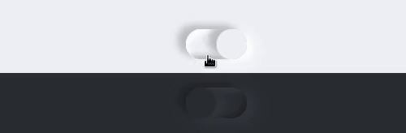

A neumorphic toggle-switch component for React.

[](https://www.npmjs.com/package/react-neumorphic-toggle) [](https://github.com/julekgwa/react-neumorphic-toggle) [](https://unpkg.com/react-neumorphic-toggle/dist/index.js)  


## Installation

```bash
$ npm install react-neumorphic-toggle
```

or

```bash
$ yarn add react-neumorphic-toggle
```

## Usage

```Javascript
import React from 'react';

import { Switch } from 'react-neumorphic-toggle';

function App() {
  return (
    <div className="App">
      <Switch />
    </div>
  );
}

export default App;
```



## API

| Prop           | Type             | Default   | Description                                                                           |   |
|----------------|------------------|-----------|---------------------------------------------------------------------------------------|---|
| autofocus      | bool             | false     | Sets or returns whether a checkbox should automatically get focus when the page loads |   |
| checked        | bool             | Required  | Sets or returns the checked state of a checkbox                                       |   |
| onChange       | func             | Required  | called when user clicks the toggle                                                    |   |
| defaultChecked | bool             | false     | Returns the default value of the checked attribute                                    |   |
| defaultValue   | string           | false     | Sets or returns the default value of a checkbox                                       |   |
| disabled       | bool             | false     | Sets or returns whether a checkbox is disabled or not                                 |   |
| form           | object           | null      | Returns a reference to the form that contains the checkbox                            |   |
| indeterminate  | bool             | false     | Sets or returns the indeterminate state of the checkbox                               |   |
| name           | string           | checkbox  | Sets or returns the value of the name attribute of a checkbox                         |   |
| required       | bool             | false     | Sets or returns whether the checkbox must be checked before submitting a form         |   |
| type           | string           | checkbox  | Returns which type of form element the checkbox is                                    |   |
| value          | string           | undefined | Sets or returns the value of the value attribute of a checkbox                        |   |
| theme          | object or string | light     | changes the theme of the toggle

## Theme

The theme prop can be used to change the theme of the toggle.

```Javascript
// supports two themes dark or light
<Switch theme='dark'/>
// default
<Switch theme='light'/>
```

or use an object

```Javascript

const theme = {
  color: '#55b9f3',
  primaryShadowColor: '#489dcf',
  secondaryShadowColor: '#62d5ff'
}

<Switch theme={theme} />
```

## License

MIT
